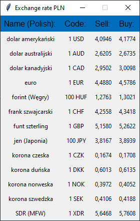

# GUI PLN exchange rate app in Python with Tkinter.
This app was created in Python with Tkinter.  
It is downloading data from [National Bank of Poland's](https://www.nbp.pl/home.aspx?f=/kursy/kursyc.html) website.  
  

